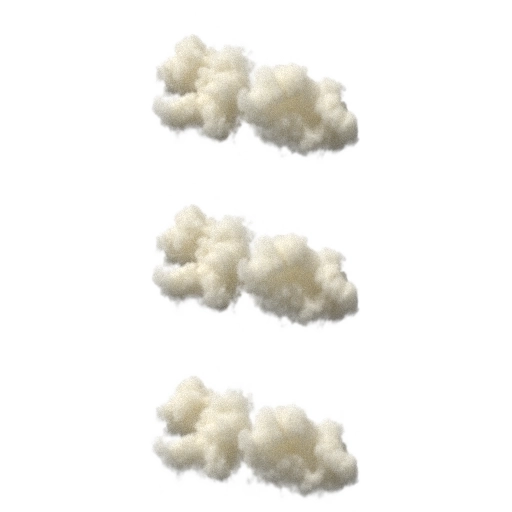

<!---->

<table >
<tr>
<td>

</td>
<td>
<h1> Cloudy </h1>
"Light Transport-aware Diffusion Posterior Sampling for Single View Reconstruction of Volumes"
</td>
</tr>
</table>

## Paper

Official implementation of the paper 

*Light Transport-aware Diffusion Posterior Sampling for Single View Reconstruction of Volumes*

[Ludwic Leonard](), [Nils Thuerey](), [Ruediger Westermann]()

Technical University of Munich

Accepted to **CVPR 2025**

> **Abstract**<br/>
> <small>
> We introduce a single-view reconstruction technique of volumetric fields in which multiple light scattering effects are omnipresent, such as in clouds. We model the unknown distribution of volumetric fields using an unconditional diffusion model trained on a novel benchmark dataset comprising 1,000 synthetically simulated volumetric density fields. The neural diffusion model is trained on the latent codes of a novel, diffusion-friendly, monoplanar representation. The generative model is used to incorporate a tailored parametric diffusion posterior sampling technique into different reconstruction tasks. A physically-based differentiable volume renderer is employed to provide gradients with respect to light transport in the latent space. This stands in contrast to classic NeRF approaches and makes the reconstructions better aligned with observed data. Through various experiments, we demonstrate single-view reconstruction of volumetric clouds at a previously unattainable quality. 
> </small>

Read from [arXiv](https://arxiv.org/abs/2501.05226).

### Citation

```bibtex
@InProceedings{Leonard_2025_CVPR,
    author    = {Leonard, Ludwic and Thurey, Nils and Westermann, R\"udiger},
    title     = {Light Transport-aware Diffusion Posterior Sampling for Single-View Reconstruction of 3D Volumes},
    booktitle = {Proceedings of the Computer Vision and Pattern Recognition Conference (CVPR)},
    month     = {June},
    year      = {2025},
    pages     = {16163-16174}
}
```

### Dataset

The dataset comprising 1400 physically based synthetic clouds, can be downloaded from [Cloudy on Hugging Face](https://huggingface.co/datasets/rendervous-project/cloudy).

### Setup

The project requires Vulkan 1.3.

```shell
sudo apt-get update -y
sudo apt-get install -y libnvidia-gl-555 vulkan-tools glslang-tools vulkan-validationlayers-dev
```

Installing from the repository:

```shell
pip install git+https://github.com/rendervous/cloudy_project.git
```

### Example
```python
import cloudy

# Creates a pipeline bound to a path used to save intermediate data and models
pipeline = cloudy.create_pipeline('./my_workspace')
# Download a cached pretrained state and some test clouds in latent form.
pipeline.download_pretrained()
# Generates a cloud with shape (128, 64, 128, 1)
cloud = pipeline.sample_volume()
# Create a recorder object (Helper class for rendering and video creation)
recorder = pipeline.create_recorder()
# Render the cloud, gets an image (512, 512, 3)
im = recorder.render_image(cloud, samples=64)
```

## Led by Example

<table>
<tr>
<td></td>
<td>
<b>Generating clouds:</b> Example showing the generative capabilities of the diffuser.
<br/><a href="https://colab.research.google.com/github/rendervous/cloudy_project/blob/main/examples/tutorial_01_generating_clouds.ipynb">open in colab</a>
</td>
</tr>


<tr>
<td></td>
<td>
<b>Cloud Super-resolution:</b> In this example, a diffusion posterior sampling technique is used to match a coarse representation with fine details.
<br/><a href="https://colab.research.google.com/github/rendervous/cloudy_project/blob/main/examples/tutorial_02_super_resolution.ipynb">open in colab</a>
</td>
</tr>

<tr>
<td></td>
<td>
<b>Cloud Inpainting:</b> In this example, a diffusion posterior sampling technique is used to match a masked volume with a cloud completion.
<br/><a href="https://colab.research.google.com/github/rendervous/cloudy_project/blob/main/examples/tutorial_03_inpainting.ipynb">open in colab</a>
</td>
</tr>

<tr>
<td></td>
<td>
<b>Single View Reconstruction:</b> In this example, a diffusion posterior sampling technique is used to match a single view.
<br/><a href="https://colab.research.google.com/github/rendervous/cloudy_project/blob/main/examples/tutorial_04_single_view_reconstruction.ipynb">open in colab</a>
</td>
</tr>

<tr>
<td></td>
<td>
<b>Sparse View Reconstruction:</b> In this example, a diffusion posterior sampling technique is used to match 3 views having a better constraint.
<br/><a href="https://colab.research.google.com/github/rendervous/cloudy_project/blob/main/examples/tutorial_05_sparse_view_reconstruction.ipynb">open in colab</a>
</td>
</tr>

<tr>
<td></td>
<td>
<b>Parameterized Reconstruction:</b> In this example, a parametric diffusion posterior sampling technique is used to match a single view and reconstruct environment and volume.
<br/><a href="https://colab.research.google.com/github/rendervous/cloudy_project/blob/main/examples/tutorial_06_parametric_sampling_environment.ipynb">open in colab</a>
</td>
</tr>

<tr>
<td></td>
<td>
<b>Legacy Sparse View Reconstruction:</b> In this example, a differentiable rendering technique is used with a sparsity prior to match 3 views. Shows the problem of the lack of a data-driven prior.
<br/><a href="https://colab.research.google.com/github/rendervous/cloudy_project/blob/main/examples/tutorial_07_legacy_reconstruction.ipynb">open in colab</a>
</td>
</tr>

<tr>
<td></td>
<td>
<b>Latent Manipulation:</b> In this example, the DPS technique is used with the latent representation directly to guide the generation of interpolated clouds. Comparison between grid, latent and dps interpolation.
<br/><a href="https://colab.research.google.com/github/rendervous/cloudy_project/blob/main/examples/tutorial_08_latent_manipulation.ipynb">open in colab</a>
</td>
</tr>

</table>


